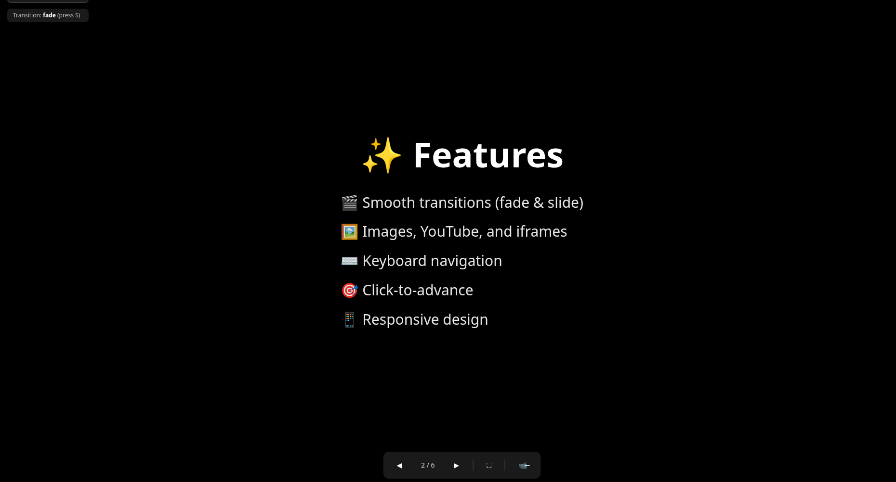

# LiveSlides

**Code-first presentations powered by React and AI.**

Create stunning, interactive presentations using Markdown/MDX and React components. Because your slides are pure code, you can leverage AI assistants to generate, customize, and refine your content instantly. Embed live web apps, videos, and rich media with beautiful gradient borders. Perfect for technical talks, live demos, and YouTube presentations.



##  Quick Start

```bash
# Install dependencies
npm install

# Start dev server
npm run dev

# Build for production
npm run build
```

**👉 [Read the Getting Started Guide](./GETTING_STARTED.md)** for a complete walkthrough!

##  Transitions

Press **S** to cycle through **10 smooth transition styles**:
- **Fade** - Classic crossfade
- **Slide** - Slides in from right, exits left
- **Scale** - Zooms in/out with fade
- **SlideUp** - Bounces up with spring physics
- **Zoom** - Dramatic zoom in/out effect
- **Flip** - 3D card flip animation
- **Blur** - Fade with blur effect
- **Rotate** - Subtle rotation with scale
- **Bounce** - Playful bouncy entrance
- **SlideDown** - Bounces down with spring physics

All transitions use Framer Motion for buttery-smooth 60fps animations!

## ✨ Key Features

- **🤖 AI-Powered Workflow** - Generate and customize slides using AI assistants like Claude or ChatGPT
- **📝 MDX Authoring** - Write slides in Markdown with React components
- **🎨 Beautiful Borders** - Gradient borders with hover effects on all media
- **🎬 10 Smooth Transitions** - Fade, slide, zoom, flip, and more (60fps via Framer Motion)
- **🖼️ Rich Media** - Images, YouTube videos, and live embedded web apps
- **📊 Deck Selector** - Switch between multiple presentations with independent slide positions
- **📹 Camera Overlay** - Block out regions for your camera feed during recording/streaming
- **📺 Presenter View** - Separate window with notes, timer, and controls for presenting
- **⌨️ Keyboard First** - Full keyboard navigation and shortcuts
- **📱 Touch Support** - Swipe gestures for mobile/tablet
- **🎭 Joke Overlays** - Trigger GIFs and reactions with hotkeys during presentations

##  Keyboard Shortcuts

- **←/→ or Space** - Navigate slides
- **F** - Toggle fullscreen
- **S** - Cycle through transitions
- **P** - Open/close Presenter View
- **C** - Toggle camera overlay (when configured)
- **1, 2, 3, Q** - Trigger joke overlays (when configured)
- **Escape** - Exit fullscreen
- **Click** - Advance to next slide
- **Swipe** - Navigate on touch devices

## 🤖 AI-Powered Workflow

Since LiveSlides presentations are pure code (MDX + React), you can use AI to:

- **Generate entire presentations** - "Create a 5-slide deck about React hooks"
- **Customize layouts** - "Make this slide split 60/40 with an image on the right"
- **Add components** - "Add a callout box highlighting this key point"
- **Refine content** - "Make this more concise" or "Add code examples"
- **Create themes** - "Update the colors to match my brand"

Just describe what you want, and your AI assistant can generate or modify the MDX files instantly!

##  Project Structure

```
src/
├── components/
│   ├── DeckSelector.jsx      # Dropdown menu for presentations
│   ├── MediaFrame.jsx        # Gradient border wrapper
│   ├── SlideChrome.jsx       # Main container with controls
│   ├── Transition.jsx        # Transition animations
│   ├── JokeOverlay.jsx       # Hotkey-triggered overlays
│   ├── slides/               # Slide type components
│   │   ├── TextSlide.jsx
│   │   ├── ImageSlide.jsx
│   │   ├── YouTubeSlide.jsx
│   │   ├── IframeSlide.jsx
│   │   └── MDXSlide.jsx
│   └── mdx-primitives/       # Reusable MDX components
│       ├── Grid.jsx
│       ├── Block.jsx
│       ├── Callout.jsx
│       └── Media.jsx
├── decks/                    # Your presentations
│   ├── quick-demo/           # Built-in demo
│   ├── demo-deck/            # MDX examples
│   └── my-presentation/      # Your custom deck
├── hooks/
│   ├── useSlideNavigation.js # Navigation logic
│   ├── useKeyboardNav.js     # Keyboard handling
│   └── useJokeManager.js     # Joke overlay system
└── App.jsx                   # Main app component
```
##  Current Status: Phase 4 Complete ✨

**Phase 1 - Core Engine:**
- ✅ All slide types (Text, Image, YouTube, Iframe, MDX)
- ✅ Keyboard navigation & click-to-advance
- ✅ Fullscreen support
- ✅ Touch/swipe gestures

**Phase 2 - MDX & Deck Loading:**
- ✅ Deck loader (deck.json + MDX files)
- ✅ MDX primitives (Grid, Block, Media, Iframe, YouTube, Callout)
- ✅ Layout system (center, split layouts, three-up, full)
- ✅ Frontmatter support for slide notes
- ✅ Multiple deck management

**Phase 3 - Polish & Interactivity:**
- ✅ 10 smooth transitions with Framer Motion
- ✅ Joke overlays with hotkeys
- ✅ Stagger animations for MDX content
- ✅ Gradient borders on all media
- ✅ Dropdown deck selector
- ✅ Per-deck slide position memory
- ✅ Camera overlay for presenter feeds
- ✅ **Presenter View** with notes, timer, controls & joke palette

**Next Phase:**
- ⬜ Export to PDF/static site
- ⬜ Advanced slide types (Terminal, Code highlighting, Charts)
- ⬜ File dialog for opening deck folders
- ⬜ Global hotkeys (system-wide)


##  Documentation

- **Product Plan:** `live_slides_product_tech_plan.md`
- **Implementation Plan:** `IMPLEMENTATION.md`
- **Camera Overlay Guide:** `CAMERA_OVERLAY.md`

##  Tech Stack

- **React 19** - UI framework
- **Vite** - Build tool
- **Tailwind CSS** - Styling
- **MDX** - Markdown with JSX for slide authoring
- **Framer Motion** - Smooth animations & transitions
- **Tauri v2** - Desktop application wrapper (Rust backend)

## 🖥️ Desktop App (Tauri)

LiveSlides can run as a native desktop application with enhanced multi-window support.

### Prerequisites
- **Rust** - Install via [rustup](https://rustup.rs/)
- **Linux**: `sudo apt-get install libwebkit2gtk-4.1-dev build-essential libssl-dev libayatana-appindicator3-dev librsvg2-dev`
- **macOS**: Xcode Command Line Tools
- **Windows**: Visual Studio Build Tools

### Running the Desktop App

**Option 1: Two terminals (recommended for development)**
```bash
# Terminal 1 - Vite dev server
npm run dev

# Terminal 2 - Tauri app
cd src-tauri && cargo run
```

**Option 2: Combined command**
```bash
npm run tauri:dev
```

### Building for Production
```bash
npm run tauri:build
```

### Desktop Features
- **Native multi-window**: Presenter and Stage views as separate native windows
- **No popup blockers**: Stage window opens reliably via Tauri APIs
- **Cross-window sync**: Slides, jokes, and state sync via Tauri events
- **Fullscreen support**: Native fullscreen on any display

## 🎯 Quick Start: Build Your Presentation

### Your presentation is ready to edit!

**Start here:** `src/decks/my-presentation/`

This folder contains a template presentation with 4 slides:
1. **Title slide** - Edit your name and topic
2. **Content slide** - Add your key points
3. **Demo slide** - Show side-by-side content
4. **Closing slide** - Thank you and contact info

### How to edit:

1. Open `src/decks/my-presentation/slides/01-title.mdx`
2. Edit the Markdown content
3. Save the file
4. The browser will auto-reload with your changes!

### File structure:
```
src/decks/my-presentation/
├── index.js              # Don't touch - imports all slides
├── deck.json             # Slide order and layouts
├── slides/
│   ├── 01-title.mdx      ← Edit these files!
│   ├── 02-content.mdx
│   ├── 03-demo.mdx
│   └── 04-closing.mdx
└── assets/
    └── images/           ← Put your images here
```

### Adding more slides:

1. Create a new `.mdx` file in `slides/` folder
2. Add it to `deck.json` slides array
3. Import it in `index.js`
4. Add it to the `mdxModules` object

See `src/decks/demo-deck/` for more examples of what's possible!
